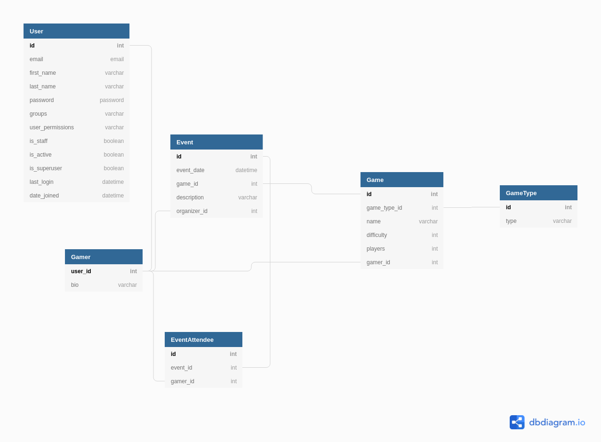

# Levelup

First NSS Django project.

# ERD

Django automatically gives you the User model.
Extend the model to add additional fields.
It should have a 1 to 1 relationship with a corresponding user entry.

